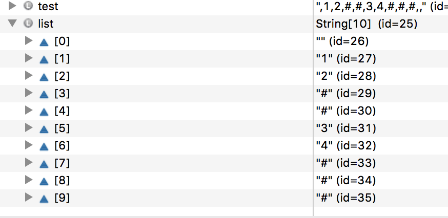

#参考
- 前序遍历比较好做
http://www.kancloud.cn/kancloud/data-structure-and-algorithm-notes/73040

http://fisherlei.blogspot.ca/2013/03/interview-serialize-and-de-serialize.html
http://stackoverflow.com/questions/4611555/how-to-serialize-binary-tree

- 分层遍历 
http://blog.csdn.net/ljiabin/article/details/49474445

- 关于s.split(",")的结果
String test = ",1,2,#,#,3,4,#,#,#,,";
String[] list = test.split(",");
得到

也就是说，开头的 “” 会被保留在结果中，结尾的“”会被忽略

总结 1
带有‘＃’的前序(后序?)遍历是可以恢复整个binary tree的，例如lintcode中给出的题目中。但是没有‘＃’则需要给出两种遍历，才可以恢复binary tree。

所以这道题的想法，是首先用preorder序列化，再用一个作用于string的全局指针idx，de-serialize

PS 有待看九章的答案