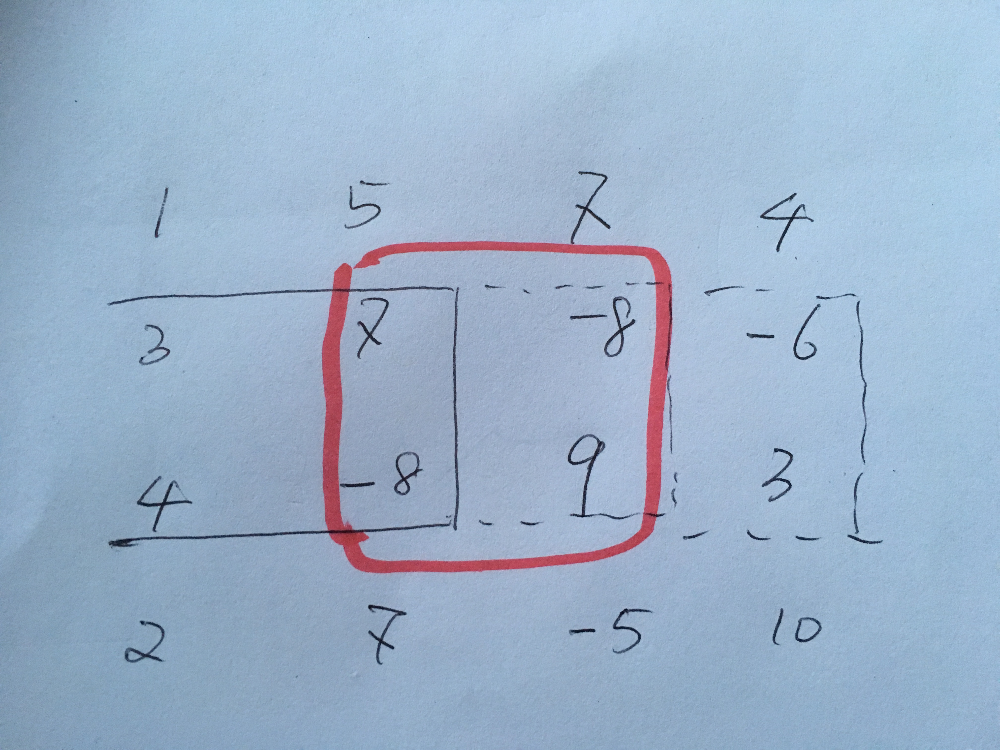
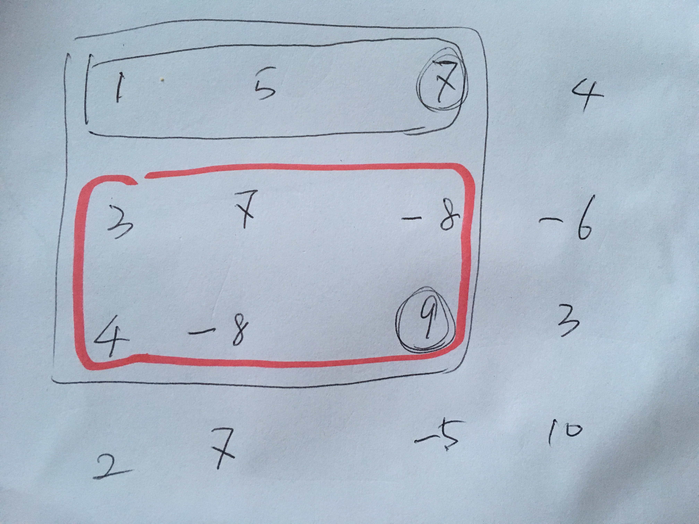

# Submatrix Sum
类比一维的情况，可以想出通过遍历不同height的block，从左到右求和。一旦发现sum出现重复，则知道找到了sum为零的block了。  
主要的问题在于这个从左到右累加的sum如何高效的求出。需要求的sum如下
  
每次固定block的上下边界，右侧边界向右扩展，同时monitor block中sum是否复现。  
这个累加的block中的sum可以如此求得  
  
通过右下角是圆圈中的数的两个黑框matrix的差，得到红框的block  

具体看程序

```java
public class Solution {
    /**
     * @param matrix an integer matrix
     * @return the coordinate of the left-up and right-down number
     */
    public int[][] submatrixSum(int[][] matrix) {
        // Write your code here
        if (matrix == null || matrix.length == 0 || matrix[0].length == 0) {
            return null;
        }
        int[][] res = new int[2][2];
        int n = matrix.length, m = matrix[0].length;
        // int[][] cul = new int[n][m];
        // for (int h = 1; h <= n; h++) {
        //     for (int i = 0; i <= n - h; i++) {
        //         // 求cul矩阵
        //         for (int j = 0; j < m; j++) {
        //             if (j = 0) {
        //                 cul[i][j] = matrix[i][j];
        //             } else {
        //                 cul[i][j] = cul[i][j - 1] + matrix[i][j];
        //             }
                    
        //         }
        //     }
        // }
        
        // 思路有一部分是对的，通过观察不同height的slice总和的变化(从左到右)，如果出现重复的sum，则找到了一个为零的block
        // 重要的思路是，从左到右生长的block，可以使用以左上角为起点的matrix做差得到
        // get sum[][], sum是到第i行 第j列的sum
        int[][] sum = new int[n + 1][m + 1];
        for (int i = 1; i <= n; i++) {
            for (int j = 1; j <= m; j++) {
                sum[i][j] = sum[i - 1][j] + sum[i][j - 1] - sum[i - 1][j - 1] + matrix[i - 1][j - 1];
            }
        }
        // System.out.println(sum[3][3]); // sum is OK
        // 
        HashMap<Integer, Integer> map = new HashMap<>(); // 存左起block的sum -> 右上角的纵坐标 (sum中的坐标)
        for (int i1 = 0; i1 < n; i1++) { // block 上边界 不包含
            for (int i2 = i1 + 1; i2 <= n; i2++) { // block 下边界 包含
                map.clear();
                // 注意j这里要从0开始，否则以下失败
                // -2 4
                // -4 2
                for (int j = 0; j <= m; j++) {
                    int diff = sum[i2][j] - sum[i1][j];
                    if (map.containsKey(diff)) {
                        // found a duplicate sum, 找到了为零的block
                        res[0][0] = i1;
                        res[0][1] = map.get(diff);
                        res[1][0] = i2 - 1;
                        res[1][1] = j - 1;
                        return res;
                    } else {
                        map.put(diff, j);
                    }
                }
            }
        }
        return res;
    }
}
```